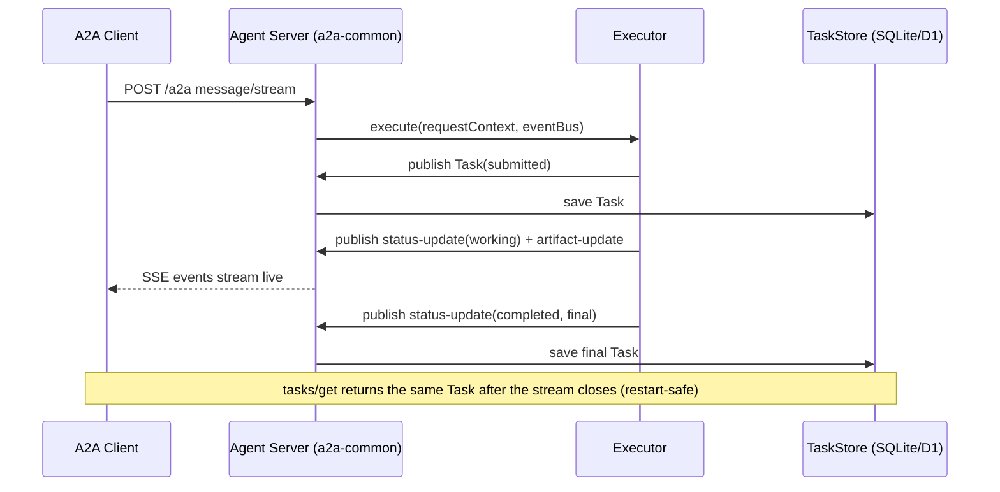
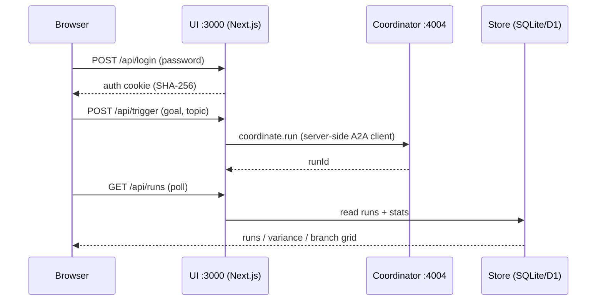

# 02 — Sequence Diagrams (integrations)

Mermaid sequence diagrams for the key flows. Each is deliberately simple — 3–5 actors, no branching — to show the **happy-path integration** between components. Error/retry paths are described in prose in [`01-as-built-architecture.md`](./01-as-built-architecture.md).

---

## 1. The closed loop (`coordinate.run`, goal `full-loop`)

The headline route: generate a synthetic source, migrate it, evaluate the result — fanned out and aggregated.

```mermaid
sequenceDiagram
    participant CO as Coordinator :4004
    participant CG as Content-Gen :4002
    participant MG as Migration :4003
    participant EV as Eval :4001

    CO->>CG: content.synthesize-source (topic, legacyStyle)
    CG-->>CO: sourceUrl + groundTruth
    CO->>MG: migration.run (sourceUrl, backend=dryrun)
    MG-->>CO: previewUrl
    CO->>EV: eval.run (targetUrl=previewUrl)
    EV-->>CO: eval-report (overallScore, dimensions)
    Note over CO,EV: one contextId across all 3 agents; fan-out branches aggregate into variance stats
```

---

## 2. A2A task lifecycle (`message/stream` over SSE)

How any single skill call flows through the shared `a2a-common` server: submit-and-stream, persisted to the store.



---

## 3. Make.com migration round-trip (through the tunnel)

The `makecom` backend: webhook out, author in da.live, callback in. The callback re-enters via the `cloudflared` tunnel (`a2a.xpri.ai`).

```mermaid
sequenceDiagram
    participant CALL as Caller (curl/coordinator)
    participant MG as Migration :4003
    participant MK as Make.com scenario
    participant DA as da.live (functions MCP)

    CALL->>MG: migration.run (backend=makecom)
    MG->>MK: POST webhook (fields + callbackUrl + taskId)
    MK->>DA: author + preview/publish page
    DA-->>MK: published previewUrl
    MK->>MG: POST /callbacks/makecom/{taskId} (report) [Bearer edge token]
    MG-->>CALL: task completed (migration-report)
    Note over MG,MK: MG parks an in-process waiter; a callback after a restart completes the task from the store
```

---

## 4. Eval job with R2 artifact storage

A real eval: queued, browser-pooled scan, screenshot uploaded to R2, durable URL written into the report.

```mermaid
sequenceDiagram
    participant CL as Caller
    participant EV as Eval :4001
    participant EN as Engine (+Chromium)
    participant R2 as Cloudflare R2

    CL->>EV: eval.run (targetUrl)
    EV->>EN: runEvaluation (4 dimensions, browser permit)
    EN-->>EV: report + screenshot file
    EV->>R2: PUT screenshot (S3 API)
    R2-->>EV: public r2.dev URL
    EV-->>CL: eval-report (scores + durable screenshot URL)
    Note over EV,R2: report row + artifacts row persisted; no R2 env -> local /artifacts stand-in, same URL contract
```

---

## 5. Public ingress — the `cloudflared` named tunnel

How a cloud caller reaches `localhost:4003` with no open ports, no public IP.

```mermaid
sequenceDiagram
    participant MK as Make.com (cloud)
    participant ED as Cloudflare edge
    participant CFD as cloudflared (laptop)
    participant MG as Migration :4003

    CFD->>ED: outbound persistent connection (4 conns)
    MK->>ED: POST https://a2a.xpri.ai/callbacks/...
    ED->>CFD: forward down the tunnel
    CFD->>MG: proxy to http://localhost:4003
    MG-->>MK: 200 (back through edge)
    Note over CFD,ED: cloudflared auto-reconnects across network changes; hostname is stable (named tunnel)
```

---

## 6. UI — trigger and read

The thin dashboard: authenticate, fire a run via the coordinator, poll results from the store.


