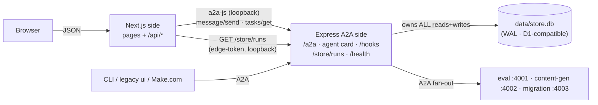

# 06 — Coordinator Dashboard + Mesh Hardening (2026-06-10)

**Date**: 2026-06-10
**Status**: ✅ Built, tested (fast tier 46/46, typecheck, `next build`, browser-verified), on `main`
**Code**: `agents/coordinator/` (now a hybrid Express-A2A + Next.js app) · `agents/a2a-common/src/net.ts` · `agents/a2a-common/migrations/0003_runs_live.sql`
**Supersedes**: the `agents/ui` thin dashboard (kept as a working legacy reference on :3000)

Three things landed in one day, each forced by the one before it: the **first Kimi K2.6 migration driven through the full closed loop** exposed two mesh-wide timeout bugs; fixing them produced **live tool/skill observability through the coordinator**; and that observability became the backbone of the **coordinator's own dashboard** — a Next.js app riding the same :4004 process with the A2A wire surface byte-for-byte unchanged.

---

## 1. Kimi K2.6 through the closed loop — and the two bugs it found

`npm run loop -- "community garden composting basics" --fan-out 1 --backend opencode --site da-live-postal-2025-07 --owner jackzhaojin`

The first attempt **failed at exactly 5:01** into the migrate stage (`TypeError: fetch failed`), and the CLI's own stream died at the same mark (`terminated`). Root cause for both: **Node 20's built-in fetch (undici) defaults to 300-second headers/body timeouts.**

- The opencode backend's blocking agentic-turn POST (`POST /session/:id/message`) runs 4–15 minutes. The standalone live test had passed at **248s — under the ceiling by luck**.
- The coordinator emitted progress notes only on stage *completion*, so its SSE stream to the CLI was silent for the whole migrate stage → idle-body timeout.

**Fixes** (both structural, not band-aids):

1. **`a2a-common/src/net.ts`** — a side-effect module (imported by the package entry, so every agent + the CLI get it) that installs a no-timeout undici dispatcher via `setGlobalDispatcher`. Both undici copies (Node's bundled one and the npm package) share the dispatcher through `Symbol.for("undici.globalDispatcher.1")`, so one call covers every fetch in the process.
2. **Child working-note forwarding** — `callAgent()` in the coordinator's executor now forwards every child `working` status note into the coordinator's own stream, prefixed `branch N · <stage>:`. One change, two wins: callers watch `K2.6 → skill da-live-author-playwright` / `K2.6 → dalive_save_dalive_content` live through the coordinator, and the SSE stream always has traffic.

**The re-run completed end-to-end** (~10 min): content-gen synthetic source on R2 → K2.6 authored + preview-published a real page (confidence 90, skill fired, 11 tools, 3 publish/refine iterations, preview HTTP 200) → the real eval engine scored it **86** (structure 96 / accessibility 100 / content 47 / visual 100). Run `4b871587`, on the dashboard.

## 2. The coordinator is now a hybrid app (one process, one port)

`agents/coordinator` upgraded in place: the Express A2A server is **byte-identical** (same `startAgentServer`, same SDK middleware), and Next.js 15 mounts as the Express **catch-all** after all A2A routes — so agent-card / `/a2a` / `/hooks` / `/health` always win, and the e2e spawn contract (`tsx src/index.ts`, `PORT`, `/health`, SIGTERM) is untouched. `COORDINATOR_UI=off` disables the UI; a UI boot failure is logged and swallowed (the agent stays up).

**The Next.js backend is database-free.** Reads go through the A2A layer's new domain endpoints — `GET /store/runs` (light list, `?contextId=` trigger-resolution) and `GET /store/runs/:id` (full detail + `a2aTaskId`) — mounted via the `extraRoutes` hook and bearer-gated by the edge token exactly like `/hooks`. Writes go through `/a2a` via a2a-js (`configuration: {blocking:false}`); in-flight runs are enriched with `tasks/get` (`a2aState`). The Express side is the store's only owner, which means **at M5 only one layer migrates to D1**.

> Hard-won routing rule: Express routes register **before** the Next catch-all, so a bare Express `GET /runs/:id` shadowed the dashboard's `/runs/[id]` *page* (the browser got 401 JSON instead of HTML — caught by browser smoke, invisible to the API tests). Hence the reserved `/store/*` prefix.

**The dashboard** (`http://localhost:4004/`) copies the v1 eval app's design near 1-1 (light shadcn/new-york, Geist, lucide — per Jack's direction) and gives:

- **Start a run** — route (full-loop / generate+migrate / evaluate / auto), fan-out, **backend selection incl. opencode/Kimi**, legacy style, da.live site/owner
- **Running now** — live cards streaming the forwarded tool/skill notes
- **Run detail** — live activity feed (auto-scrolling), branch grid (stage chips + durations + preview links), score hero, per-dimension variance with bars
- **My history** — browser-localStorage trail (v1 decision), reconciled against store outcomes; the store remains the durable record
- **Mesh chips** — live health of all four agents

**Persistence for liveness**: migration `0003_runs_live.sql` added `runs.context_id` (join a trigger's contextId → run row) and `runs.progress` (capped `{ts,note}[]`, written per working-note), and the final `stats` JSON now embeds `branchResults`. *Apply 0003 to D1 before M5.*

## 3. Supporting changes

- **CLI**: `loop` gained `--site` / `--owner` (a real backend would otherwise default to the non-writable `demo-site`).
- **Tests**: fast tier 45 → **46** — `coordinator-batch` now covers `/store/runs` + `/store/runs/:id` (light-vs-full payloads, `a2aTaskId` join, 401-when-gated, 404), and its note-count assertion was tightened to terminal stage notes (forwarded child notes changed the raw count by design).
- **Mock-layer map** (clarified for the record): migration = `dryrun` fake / `opencode` + `makecom` real / `sdk` stub; eval = `stub` engine (tests only) vs `real` engine — deterministic always, **agentic only when `CLAUDE_CODE_OAUTH_TOKEN` is set** (silent try/catch fallback; every demo so far scored deterministic-only); content-gen = template tier (no LLM, Agent SDK tier is M3); coordinator = always real (state-table `auto`, LLM planner is M3).
- **Docs**: gotchas recorded in `coordinator/CLAUDE.md` (route shadowing, db-free Next rules, undici), `a2a-common/CLAUDE.md` (net.ts, 0003), `migration-agent/CLAUDE.md` (the 248s-was-luck note), `e2e/CLAUDE.md` (run the fast tier bare — sourcing `.env` breaks open-mode tests by design).

## What this unlocks

- **The demo surface for adaptTo()**: trigger a Kimi-vs-Claude comparison from a browser and watch both migrations' tool calls stream live — no terminal required.
- **A clean M5 data story**: one store owner (the A2A layer) to point at D1; the dashboard needs zero changes.
- **Next**: flip on agentic eval (`CLAUDE_CODE_OAUTH_TOKEN`) so content scores carry judgment, then the `sdk` backend for the true head-to-head.
