# Architecture - the content factory, diagram by diagram

A mesh of AI agents that generates, migrates, and evaluates real Edge Delivery Services content on da.live, with people at the checkpoints they choose. This page is the diagram-first map of the current system (v2.9). Every diagram is hand-authored SVG and uses one color code:

| Color | Meaning |
|---|---|
| **black** | a person |
| **blue** | deterministic logic (plain code, no model) |
| **red** | agentic logic (a model deciding) |
| **purple** | a mix of both |

For links to the repos, the live demo, and the tools used, see [REFERENCES.md](../../REFERENCES.md). For operational depth (run it, deploy it, test it), see [agents/README.md](../../agents/README.md).

---

## How the agentic parts work

Four agents, each its own A2A server. The pattern repeats in every one: a deterministic floor that always works, an agentic tier on top, and a record of which one produced the result.

| Agent | What is agentic | What stays deterministic | Model | Tools the model gets |
|---|---|---|---|---|
| **coordinator** | nothing inside it; when a run has no topic it asks content-gen to pick one | the route table (`evaluate`, `migrate`, `generate+migrate`, `full-loop`, `auto`), fan-out, variance stats, one `contextId` per run | none | none |
| **content-gen** | picks a topic, writes the brief and the prose | a template tier that always works, costs nothing, and is what CI runs; any agentic failure falls back to it and the fallback is recorded | Claude (Agent SDK) | none; the model writes tool-free, plain code puts the page on R2 |
| **migration** | reads the source, decides the structure, authors real EDS blocks, previews, checks its own page in a browser, fixes what looks off | the `migration.run` contract, the backend seam, reading the memory page, logging every tool call and what it read | Kimi K3 by default (opencode), or Claude Sonnet 5 / Opus 5 / Haiku 4.5 (Agent SDK), picked per run | da.live MCP (6 CMS tools), Playwright MCP (5 browser tools), the `da-live-author-playwright` skill, harness built-ins |
| **eval** | judges each of four dimensions (structure, accessibility, content, visual) and, after a run, writes new rules into memory (`eval.reflect`) | cheerio, axe-core in real Chromium, Playwright screenshots, text diffs; the blend and the mode badge on every score | Claude (Agent SDK) | Playwright MCP, filesystem MCP, vision on the screenshots |

Three things make the agentic work improve over time:

- **Skill file.** The migration prompt runs the same [`da-live-author-playwright`](../../.claude/skills/da-live-author-playwright/SKILL.md) skill a human Claude session uses, under either model vendor.
- **Memory.** A da.live page (`/ai-content/memory`) that the migration agent reads before every run and the eval agent appends to after every scored run. Humans edit it directly; agents only append. It holds curated rules first, then an append-only run log.
- **Block library.** One showcase page per block on the target site. The migrator opens the page for each block it is about to author, and the run log proves it (`blocksLookedAt`).

The measured effect of memory: the same five-model benchmark, re-run with memory on, held or improved every model ([results](../../ai-docs/2026-09-08-model-assessment-with-memory/)).

Nothing in the mesh can publish to the live site. Pages land as `.aem.page` previews and a person decides what goes live.

Code: [`migration-agent/src/backends/`](../../agents/migration-agent/src/backends/) (the seam + `opencode.ts`, `sdk.ts`, `dryrun.ts`, `makecom.ts`) · [`opencode-prompt.ts`](../../agents/migration-agent/src/backends/opencode-prompt.ts) (the migration prompt) · [`usage.ts`](../../agents/migration-agent/src/usage.ts) (read evidence) · [`content-gen/src/agentic.ts`](../../agents/content-gen/src/agentic.ts) · [`eval-service/src/engine/agents/`](../../agents/eval-service/src/engine/agents/) (per-dimension `deterministic` + `agentic` pairs) · [`eval-service/src/reflect.ts`](../../agents/eval-service/src/reflect.ts) · [`a2a-common/src/memory.ts`](../../agents/a2a-common/src/memory.ts)

---

## 1 - Where it started (v1)

### The v1 system (2025)

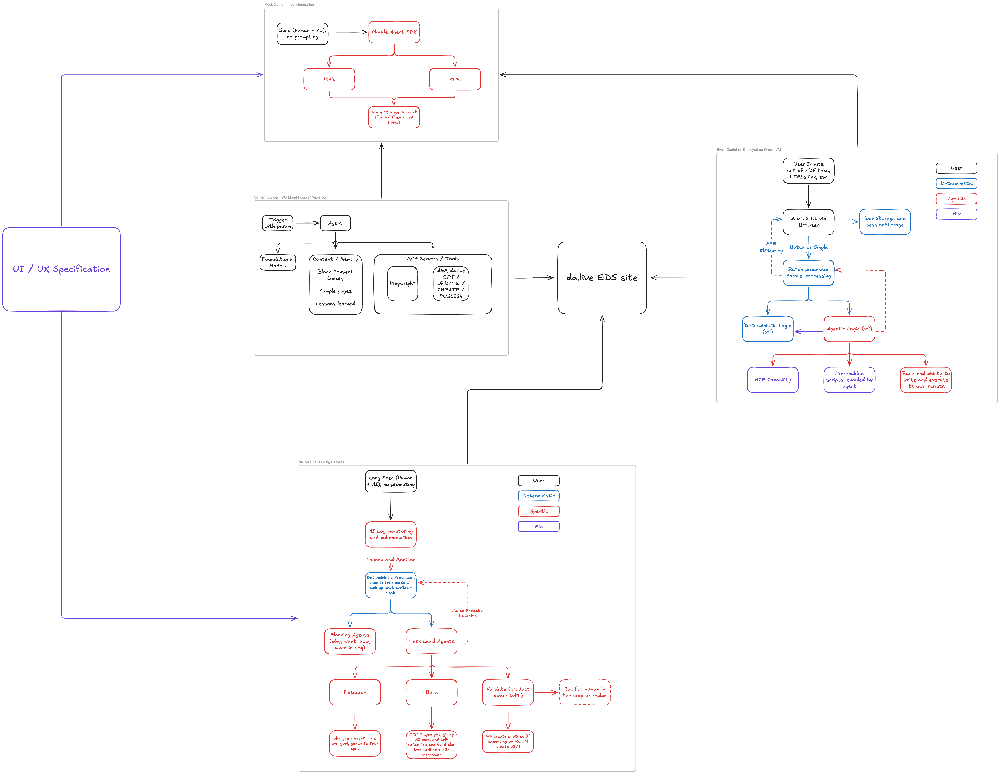

Four working pieces: an eval app in a container, a Make.com / Workfront Fusion content builder driving a custom da.live MCP, a mock content generator, and an Agent SDK harness that built the site. Every piece ran. Nothing connected them; output moved between systems by hand.

### Orchestration separated from intelligence

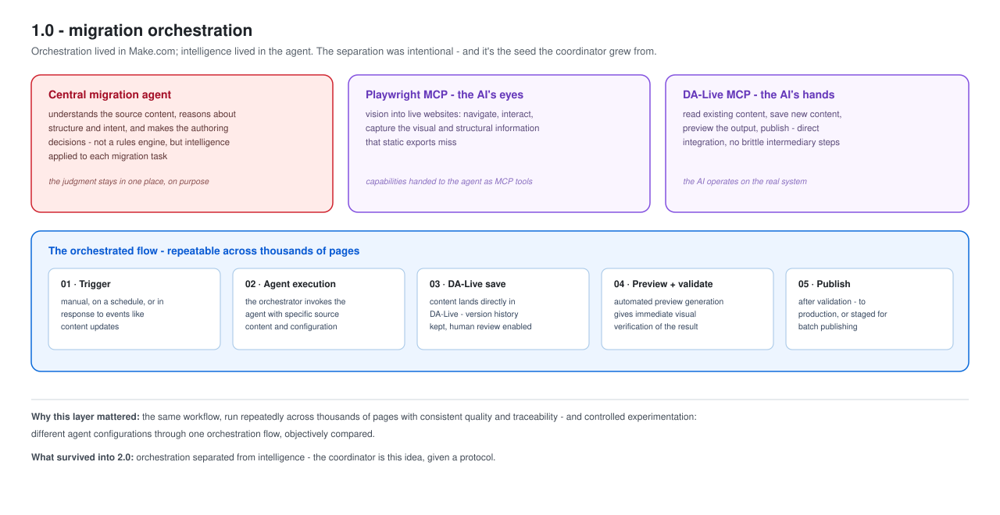

The orchestrator owned sequencing, retries, and coordination; the agent owned understanding and authoring. The v2 coordinator keeps this split.

### The agent could see

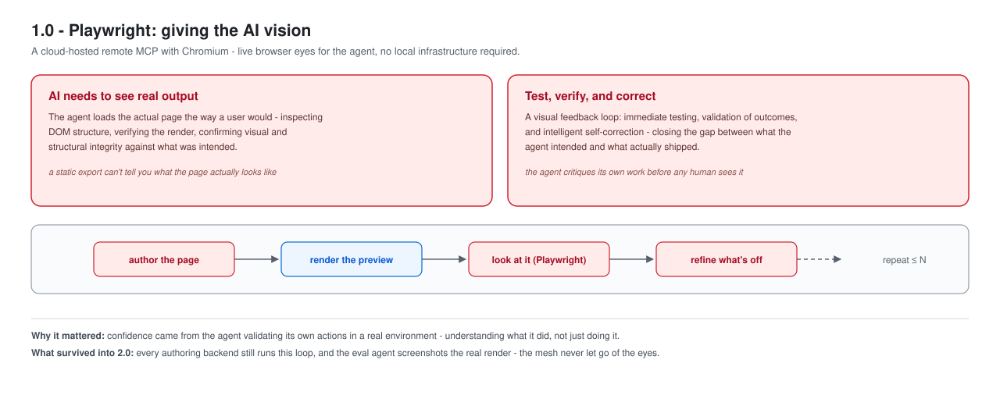

A remote Playwright MCP let the agent open its own preview in a real browser and fix what looked wrong. Every v2 authoring backend still does this.

### Evals designed in, already decoupled

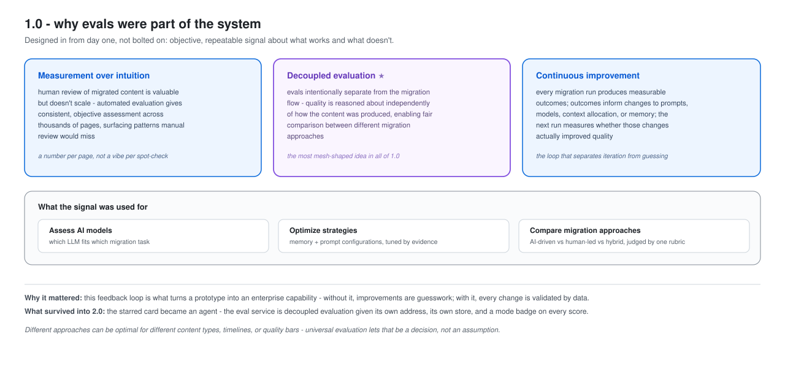

Evaluation ran outside the migration flow so different approaches could be compared on one rubric. In v2 it became its own agent.

---

## 2 - The v2 design

### The coordinator

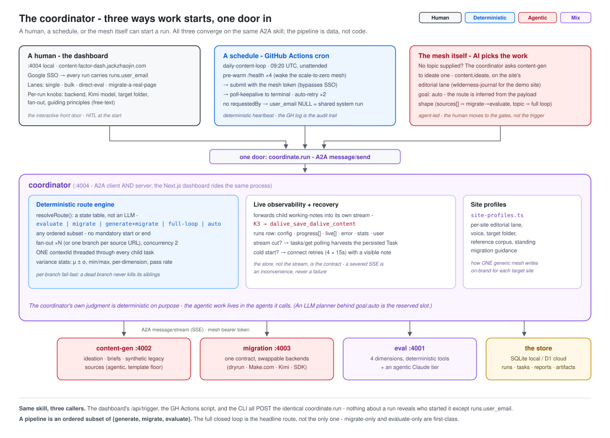

A run can start from the dashboard, a GitHub Actions cron, or the mesh itself. All three call one A2A skill, `coordinate.run`. Inside, the coordinator is a route table, not a model. Code: [`coordinator/src/executor.ts`](../../agents/coordinator/src/executor.ts), [`site-profiles.ts`](../../agents/coordinator/src/site-profiles.ts).

### The migration agent

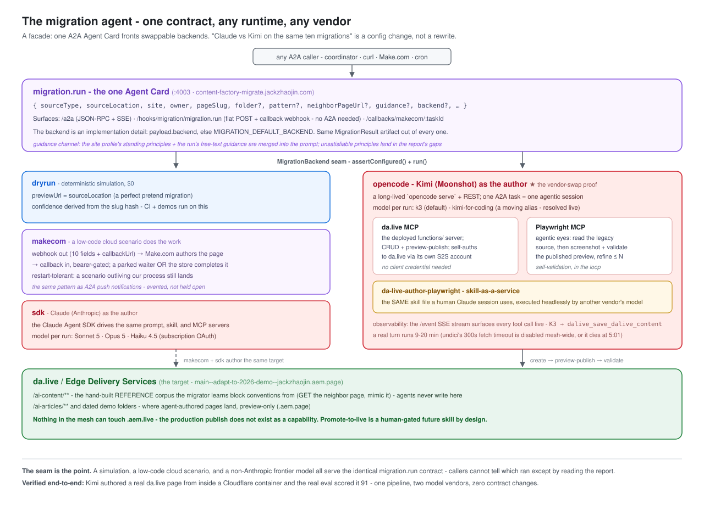

One contract, swappable backends: `dryrun` (CI), `makecom`, `opencode` (Kimi), `sdk` (Claude). Comparing models is a config change. Contract: [`contracts/migration.run.v1.json`](../../agents/contracts/migration.run.v1.json).

### The content generator

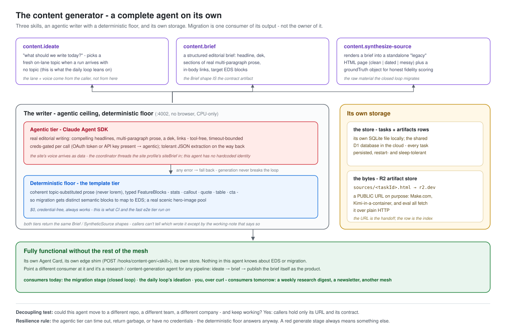

Three skills (ideate, brief, synthetic source page), an agentic writer over a template floor, and its own storage. It works without the rest of the mesh.

### The eval agent

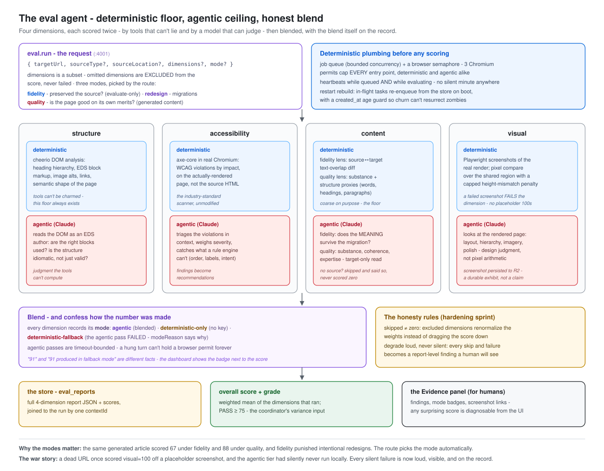

Four dimensions, each scored by tools and by a model, then blended. Every score carries a mode badge saying how it was made. The route picks the mode: `quality` for generated pages, `redesign` for migrations, `fidelity` for evaluate-only.

### The whole mesh

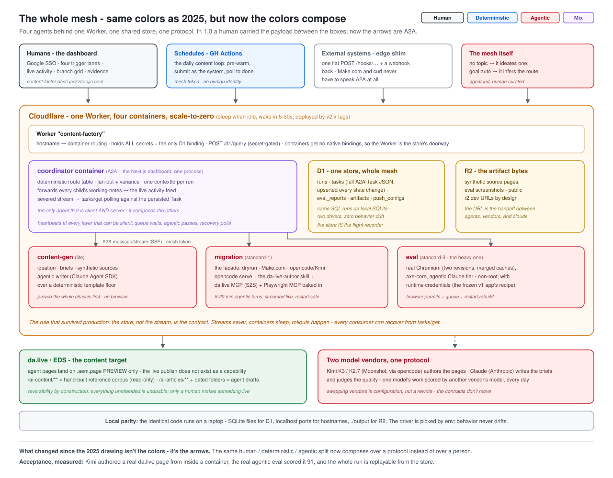

Four agents behind one Cloudflare Worker, one shared store (D1 in the cloud, SQLite locally, same SQL), artifacts on R2. Every agent writes full task state on every change, so any consumer can recover from `tasks/get`. Code: [`a2a-common/src/server.ts`](../../agents/a2a-common/src/server.ts).

### A2A and MCP

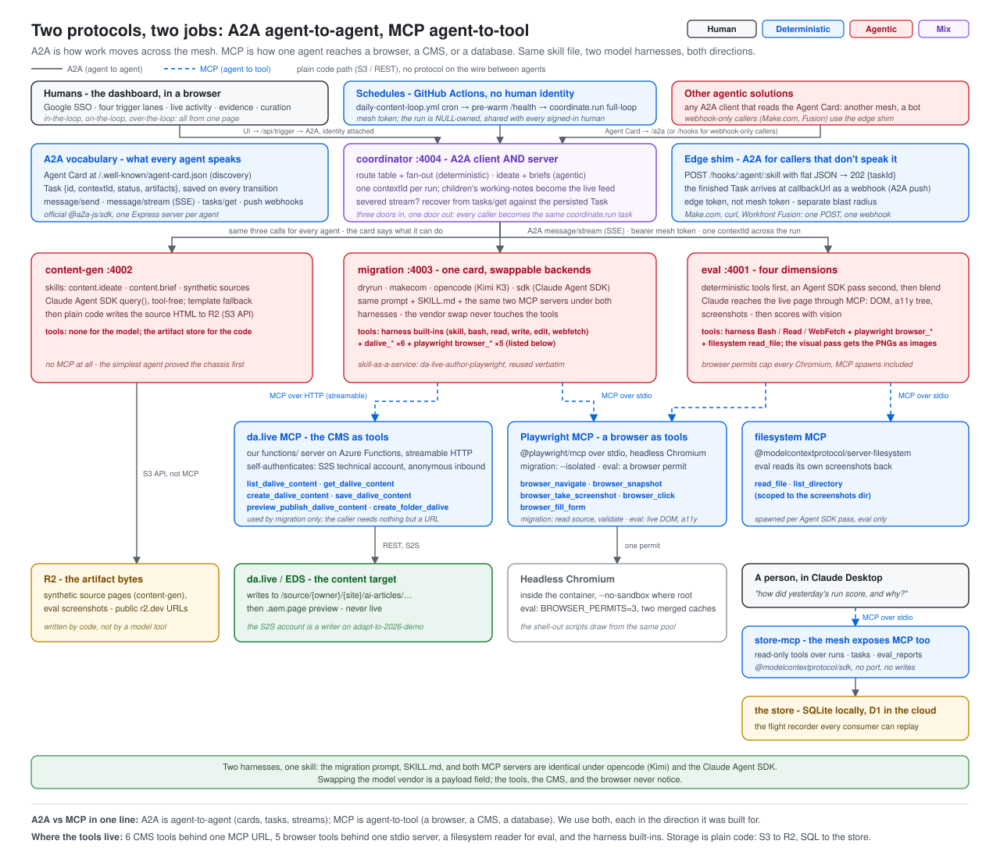

A2A is agent to agent (Agent Cards, tasks, streams). MCP is agent to tool (a browser, a CMS, a filesystem). This shows every door into the mesh, every MCP server, and every named tool behind each. The mesh also exposes its own read-only MCP server ([`store-mcp`](../../agents/store-mcp/)) so a person can ask Claude Desktop how a run scored. Code: [`opencode-config.ts`](../../agents/migration-agent/src/backends/opencode-config.ts), [`eval-service/src/engine/mcp-config.ts`](../../agents/eval-service/src/engine/mcp-config.ts), the da.live MCP server in [`functions/`](../../functions/).

### The server side

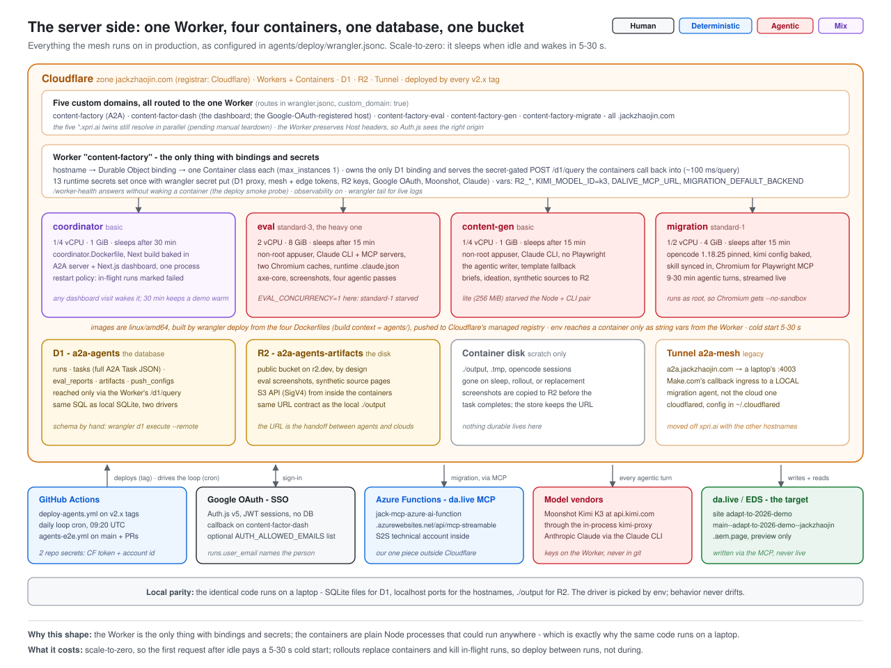

One Worker, four containers with their sizes, D1, R2, the tunnel, the custom domains, and everything outside Cloudflare (Google OAuth, the da.live MCP on Azure Functions, the model vendors, da.live). Code: [`deploy/wrangler.jsonc`](../../agents/deploy/wrangler.jsonc), [`deploy/src/index.ts`](../../agents/deploy/src/index.ts).

### Dev ops

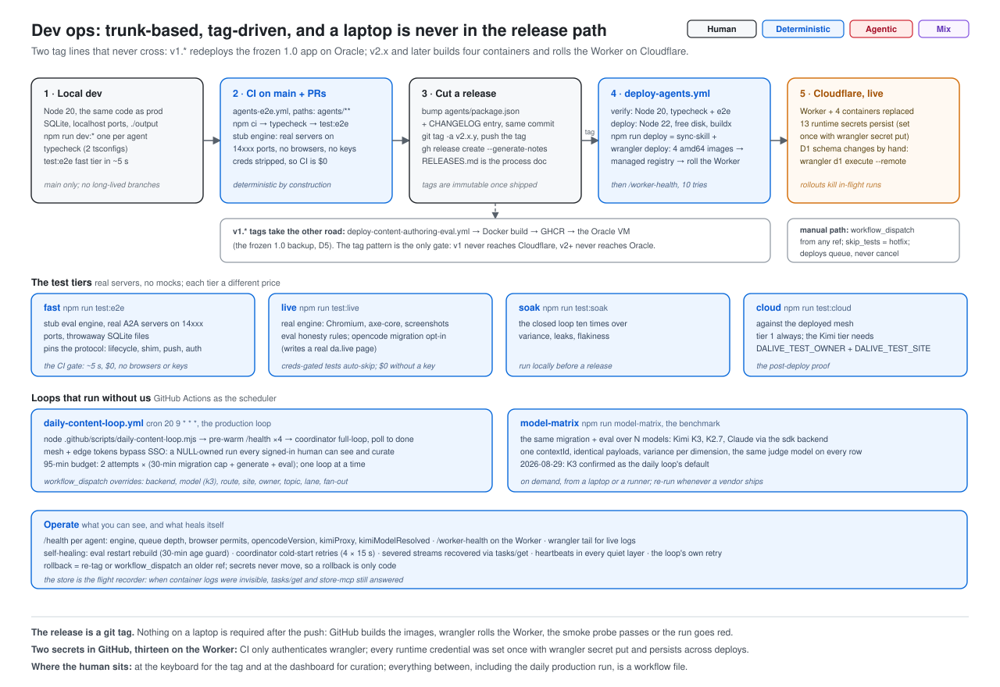

Trunk-based, and a release is a git tag. The tag builds four images and rolls the Worker. The same GitHub Actions scheduler runs the daily production loop. Also shown: the four test tiers and what heals itself. Code: [`deploy-agents.yml`](../../.github/workflows/deploy-agents.yml), [`agents-e2e.yml`](../../.github/workflows/agents-e2e.yml), [`daily-content-loop.yml`](../../.github/workflows/daily-content-loop.yml), [`agents/e2e/`](../../agents/e2e/), [`RELEASES.md`](../../RELEASES.md).

---

## 3 - Use cases: the same four agents, different routes

A route is an ordered list drawn from {generate, migrate, evaluate}, so the same agents cover workflows nobody wired up in advance. The use-case diagrams share one swimlane layout (Human / Agentic / Deterministic) so you can see where the person sits in each.

| Diagram | Route | Status | Where the person sits |
|---|---|---|---|
| [Migrate a real legacy site](4-1-site-migration.svg) | migrate, evaluate | running | picks the pages, judges the result |
| [The daily content loop](4-2-daily-loop.svg) | generate, migrate, evaluate | running every morning | curates the drafts later |
| [Weekly trend research](4-3-trend-research.svg) | generate only | concept | owns the watch-list, reads the digest |
| [Content supply chain](4-4-content-supply-chain.svg) | Workfront-triggered generate, migrate, evaluate | concept | approves once in Workfront, reviews the preview |
| [Eval as a quality gate](4-5-quality-gate.svg) | evaluate only, called by an outside pipeline | concept | sees only the escalations |

---

## 4 - What's next

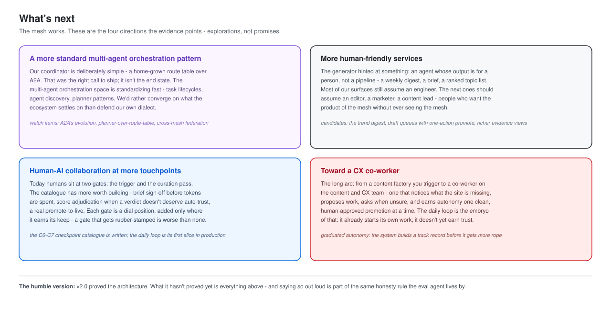

Four directions, no promises: a more standard orchestration pattern, more human-facing services, more collaboration checkpoints, and a system that earns autonomy one step at a time.

---

## Contributing diagrams

- Hand-authored SVG, `viewBox="0 0 1280 <H>"`, white background, title and subtitle at the top, takeaway lines at the bottom.
- Name it `<section>-<n>-<slug>.svg` to match this page.
- Use the four-color legend above; use-case diagrams reuse the three-swimlane layout.
- Render it in a real browser before committing; diagrams must not overflow.
